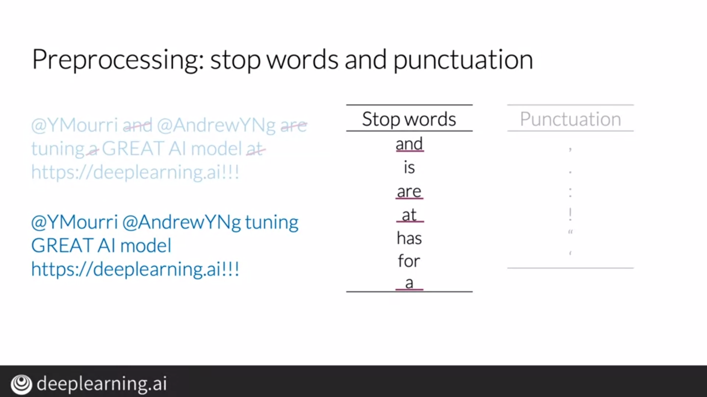
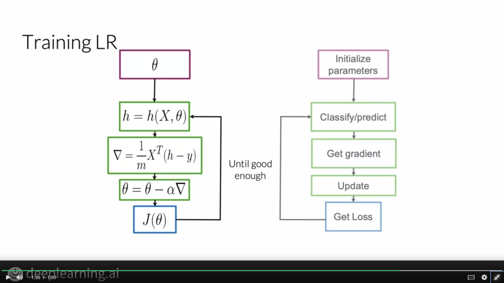

# Supervised ML and Sentiment Analysis
## Steps required:
><ul>
><li>Extract Features from text</li>
><li>Train a classifier on the extracted features by minimizing the cost</li>
><li>Classify text documents</li>
></ul>

# Vocabulary and Feature Extraction
## Creaing Sparse Arrays in the manner shown below:

# Postive and Negative Frequency
## We keep a track of the frequency of a word with reference to the classes(positive and negative).

The mapping is done in a dictionary format from (word,class)->frequency

# Feature Extraction with Tweets
## Creating a vector for a particular tweet using the method shown below:
 
## Example:

# Text Preprocessing
1) Stop Words:
    
Words like "the", "that", etc that don't help the model classify a document are stop words. These words occur commonly because they have grammatical and syntactic impact but don't help the model classify the document. Removing stop words helps us preprocess the data

2) Stemming:
    
There are many words that essentially convey the same meaning to the model but might have different forms. For example, run and running convey the same meaning, so the model should stem words like running to run to interpret them similarly.

# Putting it all together
## Steps involved:
><ul>
><li>Construct frequency dictionary by creating mappings from (word,class)->frequency</li>
><li>Iterate through all tweets and process them by removing stopwords, punctuations and by stemming them.</li>
><li>Create the vector as specified in Feature Extraction.</li>

# Overview of Logistic Regression

Using parameters, we can predict an output labels with the help of the sigmoid function and then we can train our model to find parameters that lead to minimum loss.

## Sigmoid Function

Sigmoid function is used for binary classification and it's formula and graph can be seen below.

We generally set a threshold of 0.5, i.e, if the output is greater than 0.5, we classify it as a positive label and if the output is lesser than 0.5, we classify it as a negative label.

# Training Logistic Regression

To train logistic regression, we use the Gradient Descent Algorithm to optimize values of the parameters in order to minimize the cost.

 

# Testing Logistic Regression

To test our model, we divide the dataset into training and validation sets. Once we find parameter values after training the model on the training dataset, we compute labels of the validation dataset using these parameters.

Then, to predict the accuracy of our model, we compare our predicted labels with the actual labels and find out how many labels we predicted correctly out of the total number of labels.

# Cost Function

To understand the cost function, let's take a look at the equation and how it changes with different values.

From the graph, we observe that the cost function depends on how close is the predicted label to the true label

