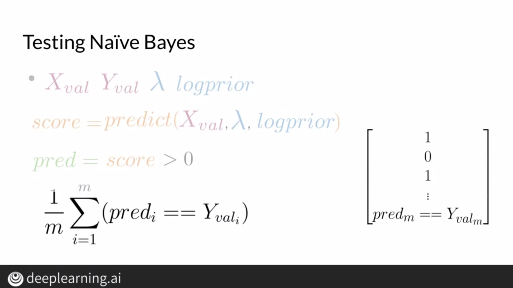
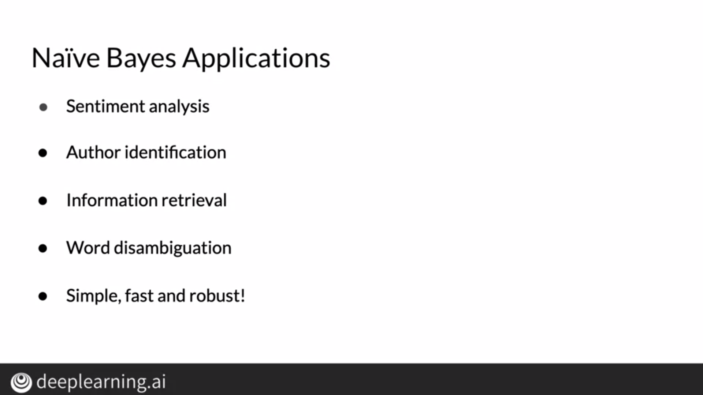

# Probability
## The probability of a tweet containing the word "happy" being positive is calculated as follows:

## Probability of a tweet being positive and containing the word "happy" is calculated as follows:

# Conditional Probability and Bayes' Rule

Conditional probability is simply the probability of an event happening given that another event has happened.

For example, the probability of a tweet being positive given the fact that the tweet contains the word "happy" is conditional probability.

As an extension of that, Bayes' rule tells us how we can find out conditional probability of y given x if we know the condition probability of x given y and we know the ratio of the probabilities of x and y.

# Naive Bayes

First, we construct a table where we try to find the conditional probabilities of the occurence of a word given the sentiment of the tweet.

Once we construct this table, we use the Naive Bayes equation as shown below to arrive at a value.

In the example shown above, we arrive at a value greater than 1, and hence we classify it as a positive tweet.

# Laplacian Smoothing

To avoid obtaining zero as a probability, we can use Laplacian Smoothing.

We add 1 in the numerator to avoid 0 in the numerator and we add the number of unique words in the vocabulary(V) to counterbalance the addition of 1 in the numerator.

# Log Likelihood

By calculating the ratio of probabilities for a particular word, we can find out how it impacts the sentiment of a tweet.

In the Naive Bayes equation, we incorporate a prior factor because we may not always have equal number of positive and negative observations.

To avoid numeric underflow caused by product of several terms, we can use logarithms as shown below.

For example,

Since the summation is greater than 0, we can classify it as a positive tweet.
 

Note, the threshold for log likelihood is 0 as compared to 1 which we used earlier since log(1)=0.

# Training Naive Bayes

To start, we first collect and annotate our corpus. Then, we preprocess the data to retain relevant words that can help the classifier.

We then construct a table to keep track of the frequency of a word occuring in a particular class of tweets.

We then compute the ratio of a particular word and apply laplacian smoothing to it. We calculate the log of the ratio which yields lambda. We compute the sum of all lambdas obtained.

Lastly, we calculate the log prior and multiply it to the equation.

# Testing Naive Bayes

To predict sentiments of tweets, we can use lamdba values computed during training. Words that aren't in the vocabulary have a lambda value of zero. If the sum of lambda values of a particular tweet is more than 0, it is a positive tweet.

We can then use a validation set to check the accuracy of our model. Data in the validation set is data the model has never seen before and we can estimate the model's performance on the basis of this dataset.

To summarize:

# Applications of Naive Bayes

Naive Bayes has multiple applications. We can use it to determine the author of a text, or to filter spam mails using the same method as we did earlier.

# Naive Bayes Assumption

Naive Bayes assumes that the features of an observation are independent of each other. In our example, it assumes as if words in a given tweet are independent of each other which may not always be the case as shown below.

In the above example, we can see that the words "sunny" and "hot" are correlated and generally tend to occur with words like "desert". Thus, Naive Bayes assumes these words to be independent when they may be dependent.

Naive Bayes also relies on relative frequencies of words in our corpus and this may not be a huge problem if our dataset is balanced, but if our dataset is not balanced, it might be biased and will largely predict labels belonging to the class with maximum frequency.

# Error Analysis

While preprocessing the tweet, we might lose significant information about the tweet and thus, it is important for us too check how these tweets look before proccessing them and what impact would processing have on such a tweet.

This example is cleary a negative tweet but after preprocessing, we're only left with positive words which will make our classifier label this tweet as positive.

Even the order of words can cause significant change in the sentiment expressed by a sentence, and since Naive Bayes doesn't consider the order of words, we need to look out for such tweets.

Lastly, adversarial attacks or figures of speech like irony, sarcasm, etc aren't accounted for in such a model and thus, it can misclassify such tweets because these models can't understand such figures of speech.

