# Vector Space Models

It would benefit us to know how certain words are correlated with others, and we could benefit from understanding these relations. We can do so by constructing vector space models which encode words as vectors and using these vectors, we can find the similarity between two words.

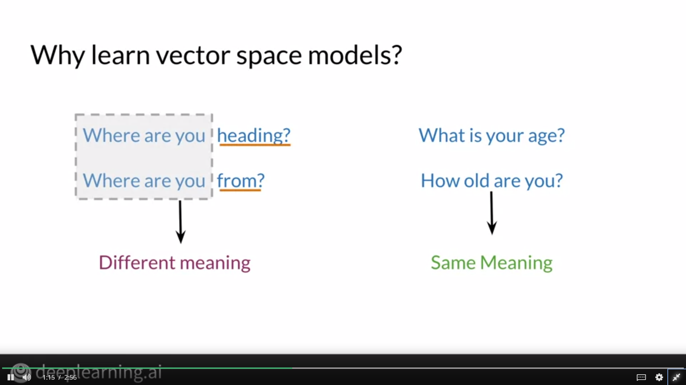

In the example below, we can see that the word "cereal" and "bowl" are related, and so are "buy" and "sells".

# Word by Word and Word by Doc

## Word By Word Design

In this method, we assign a value to a variable k, and then we count the number of occurences of other words at a distance of k from the word we want to encode.

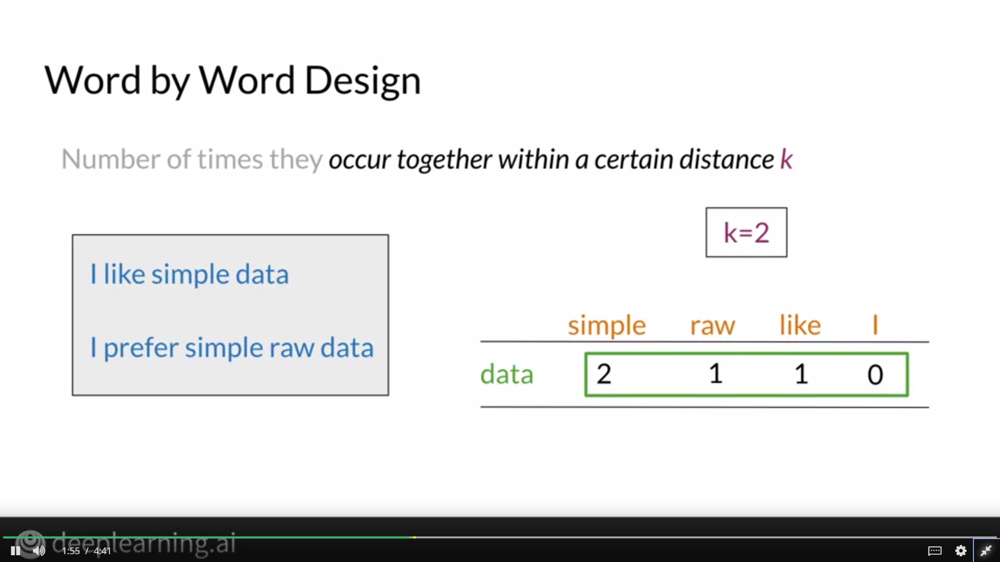
In the above example, we encode the word "data" by counting the number of occurences of other words at a distance of 2 from it.

## Word by Document Design

In this method, we encode a word by the number of occurences of that word in various topics.

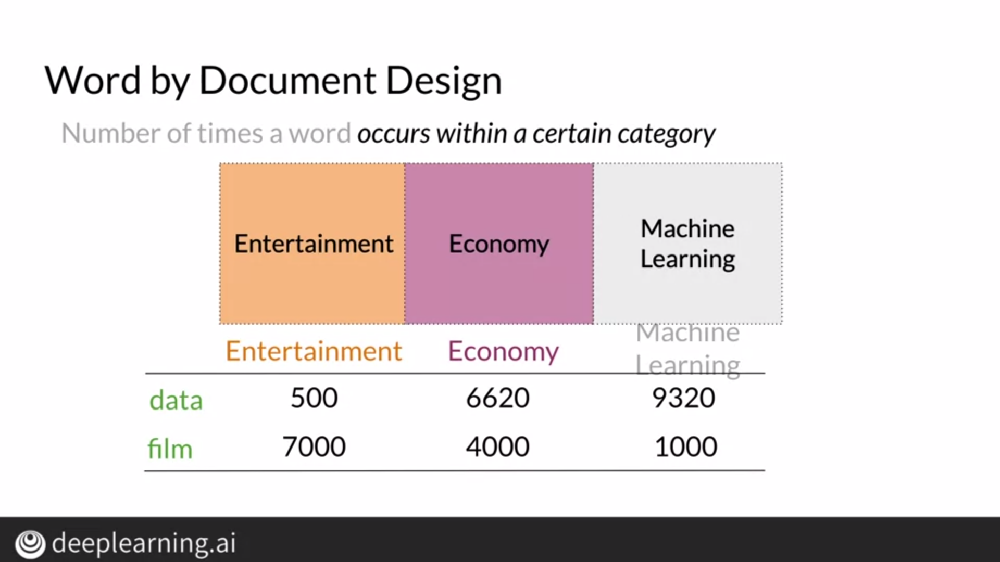
In the above example, the word "data" appears 500 times in documents with a topic "entertainment".

# Euclidean Distance

Euclidean Distance is measure of the distance between two points or vectors. Using the Euclidean Distance, we can find out how similar 2 documents or words might be.

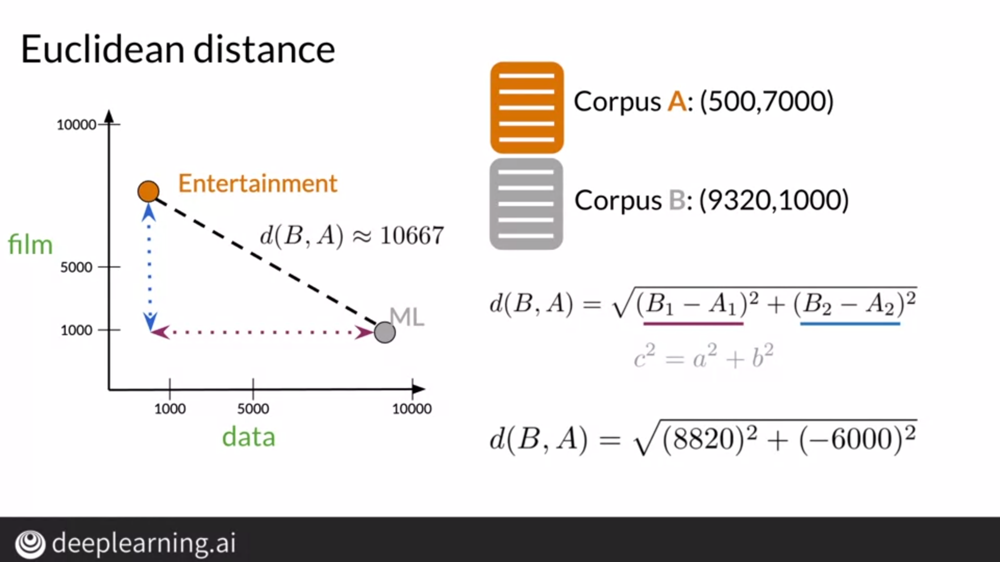

For n-dimensional vectors, we can find out the difference of 2 vectors and then take their norm to find out the Euclidean Distance. We can find the norm by using numpy's Linear Algebra library.

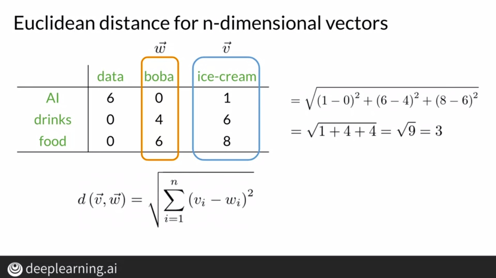

# Cosine Similarity

Euclidean Distance can be misleading at times because there's a size bias involved. To understand this, take a look at the example below.

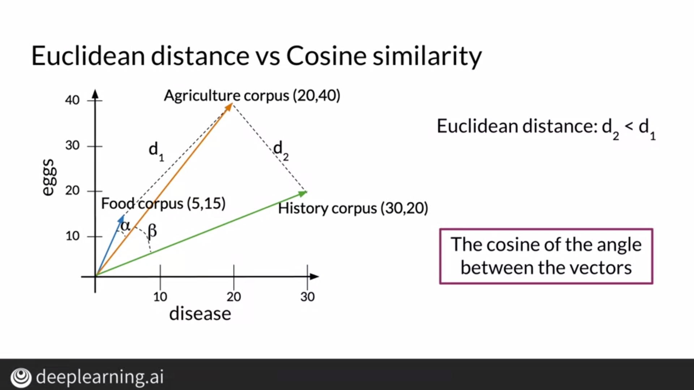
If we were to go by the Euclidean Distance, we'd think that the agriculture corpus is similar to the history corpus as compared to the food corpus but that's only the case because the food corpus has lesser documents as compared to the other 2 corpora.

Using cosine similarity, we can find the cosine of the angle between 2 vectors. More the similarity, smaller the angle.

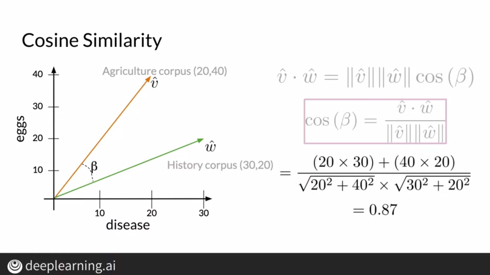

# Manipulating Words in Vector Spaces

If we know the relationship between a country and it's capital in a vector space, we can use this relationship to find the capital of a given country and vice-versa.

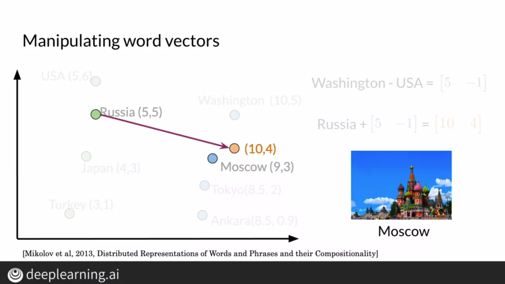

Once we know which vector joins USA and Washington DC, we can use the direction of that vector and connect Russia to it's capital.

# Principal Component Analysis

For the sake of visualization, we need to project our n-dimensional data onto a 2D plane without losing much information about the data. To do so, we can use the PCA Algorithm.

Firstly, we need to find the uncorrelated features of the data and then we need to project these features onto a lower dimensional space.

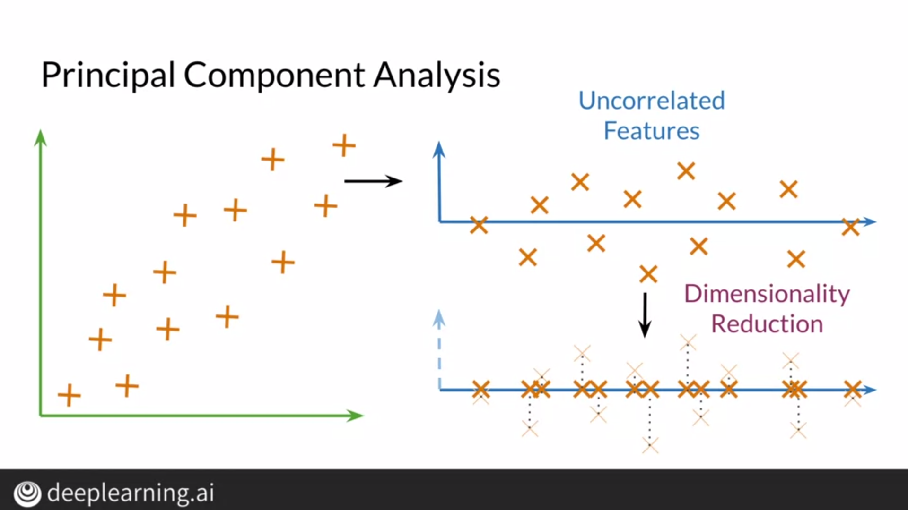

## Finding Uncorrelated Features

To find uncorrelated features, we find the eigen vectors which represent the direction of these features and the eigen values represent the amount of information retained or the variance in these features.

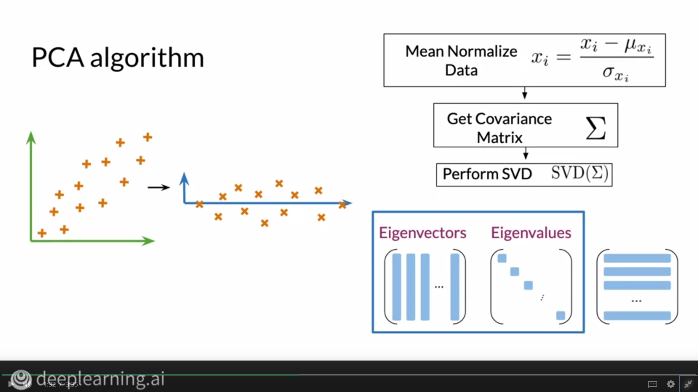

## Projecting these features

To project these features, we take the dot product of the word embeddings with the matrix of eigen vectors with columns equal to the dimension of the space we want to project the features to. For visualization purposes, we project these features to a 2D space. We can also find the amount of information retained using the eigen values.

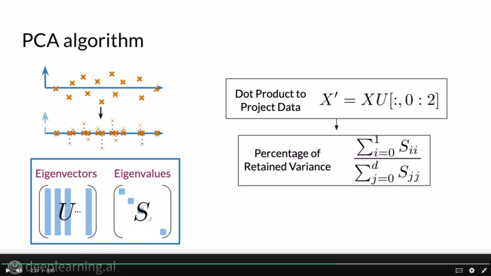