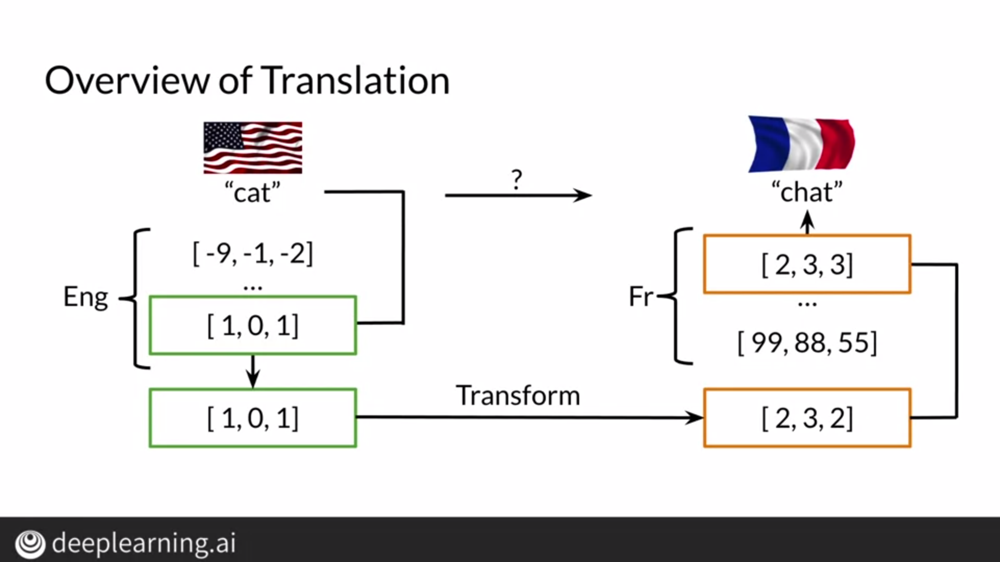
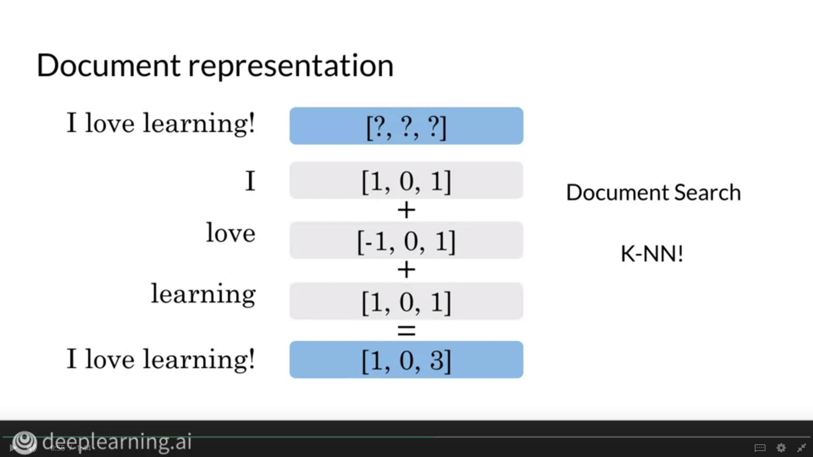

# Transforming Word Vectors

For machine translation, we can create a list of words in English and corresponding to that list, we'll create a list of words in French. After creating these 2 lists, we try to find a transformation function that gives us the French word when we input an English word. We find this transformation function by using a subset of this vocabulary and then we can try this function on words the function hasn't seen before.

## Frobenius Norm

We can use the Frobenius Norm to find the similarity between the output of our transformation and the French word corresponding to the English word. We'll see how to use the Frobenius Norm in our loss function to find R or the transformation function.

## Loss Function

Initially, we assign random values to the matrix R and then we use the square of the Frobenius Norm as our loss function to update the values of R using gradient descent. We choose the square of Frobenius Norm as our loss function because finding the derivative of our loss function becomes a lot mroe convenient.

# K Nearest Neighbors

After transforming our English word, we need to find French words closest to our transformation. This can be a lengthy process if we don't create subsets of data to search from. To create these subsets, we can use K-Nearest Neighbors and Hash Tables and thus, we can find words from a particular subset.

# Hash Tables and Hash Functions

In this hash table, we store vectors by calculating hash values from the hash function.

We create a dictionary with keys equal to number of buckets and these keys correspond to a list which will store vectors pertaining to that key.

However, we should try storing vectors which are closer to each other together and to do so, we use locality sensitive hashing.

# Locality Sensitive Hashing

In the vector space, if we were able to find planes that separated dissimilar points, we'd be able to divide them into subsets and hash them accordingly.

We can find the dot product of observations with the plane to classify them into subsets. A positive dot product indicates that the observation is in the direction of the plane, whereas a negative dot product indicates that the observation is in the negative direction of the plane.

# Multiple Planes

To create multiple subsets, we need to use multiple planes. However, we also want a single hash value from multiple planes and let's see how we can do that.

If the dot product is positive, assign a value of 1, else 0. Using these values, compute the hash as shown above.

# Approximate Nearest Neighbours

In order to make our application more robust, we can try out more than one set of random planes to expand our scope of search. We tradeoff precision for efficiency by doing so.

In the example shown above, one set of planes put magenta and green points in the same bucket, whereas another set of planes put magenta and blue points in the same bucket.

# Document Search

We can use the KNN algorithm to find documents. To do so, we first need to embed documents in a vector. One way to do this is by summing up all the word vectors corresponding to the words present in the document.

