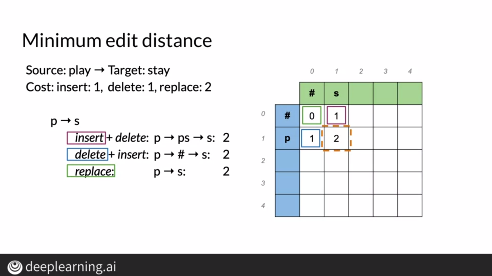

# Autocorrect

In smartphones and word processors, autocorrect has become a common and useful feature allowing people to type faster without having typos. When a user misspells a word, autocorrect basically changes the misspelled word to a word the user intended to type or a word closest to the misspelled word.

## How it Works

First, we identify a misspelled word. We then try finding words most similar to this word or words least edits away from the misspelled word. We then filter our candidates and find word probabilities to replace the misspelled word.

# Building the Model

## Identifying misspelled words

A simple way to identify a misspelled word would be to check if the word is in our vocabulary. However, there's a caveat to keep in mind while implementing this technique since this doesn't consider the context of the word and this can lead to errors as show below.

## Find Strings n edits away

To find words closest to our misspelled word, we can try editing one a few characters of the word. For autocorrect, we generally only consider words upto 2 edits away. There are 4 kinds of edit operations as shown below.

## Filter Candidates

After finding a set of words by using n edits, we need to retain words which exist in our vocabulary and we can do so by filtering out words not present in our vocabulary.

## Calculating Probabilities

We calculate the probability of a replacement candidate for the misspelled word as the number of times it appears in the corpus divided by the total number of words in the corpus.

# Minimum Edit Distance

Minimum edit distance is the minimum cost incurred in editing one string into another. We have 3 edit operations, namely insert, delete and replace. These operations may or may not have different costs and we need to minimize this cost to find the closest string.

# Minimum Edit Distance Algorithm

The minimum distance algorithm follows a recursive approach with dynamic programming where we break the problem into smaller subproblems and store intermediate values to arrive at the final value.

As seen in the image above, we construct a matrix and try computing the minimum edit distance between substrings of the original string. D[i,j] represents the minimum cost incurred in transforming the first i characters of source string to first j characters of destination string and we store this cost at (i,j) index.

To compute the minimum cost, we need to try all approaches and take the minimum of all these approaches.

For example, to convert p to s, we can use three approaches as shown above. We then take the minimum of these three costs and store it in the matrix. Note, we make use of adjacent values in the matrix for computation so we need to store intermediate values.

## Filling the first column

To change a source string into an empty string, we need to perform deletion operations equal to the length of the source string so finding the cost is very straightforward in this scenario.

## Filling the first row

Similarly, to transform an empty string into a target string we need to perform insertion operations equal to the length of the target string.

## Final Formula

This formula allows us to compute values of the table and can be interpreted as taking the minimum cost of all operations for a particular cell in the matrix.

This cost calculated is also called the Levenshtein Distance. Apart from the cost, we may also need to know the steps involved in transforming the string into its target and we can use backtrace for the same. The approach we took is called Dynamic Programming where we solve subproblems and use the results of these subproblems to eventually find the result of our main problem
 

