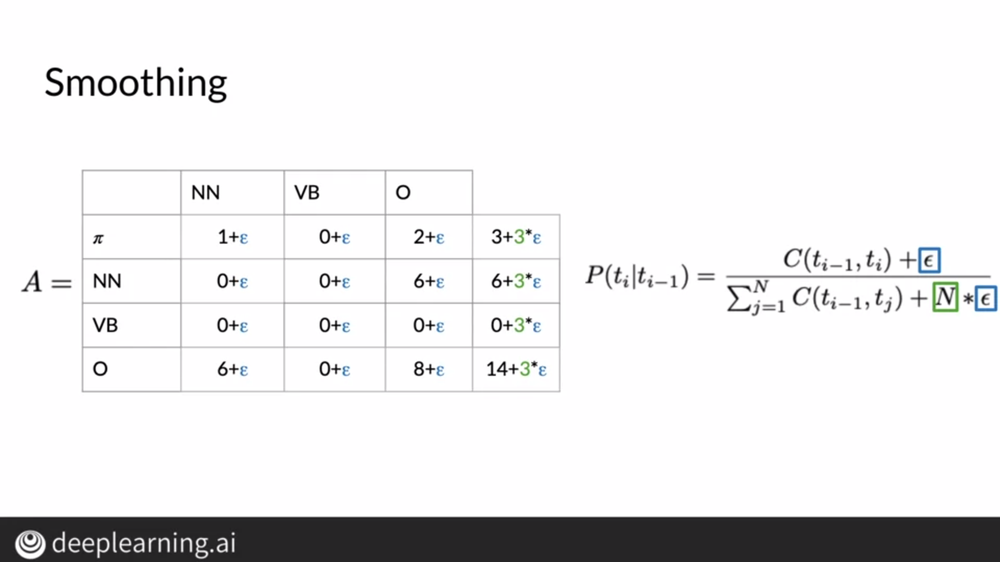

# Part of Speech Tagging

Part of speech tagging is the process by which we identify the lexical terms related to words. For example, it lets us identify which word is a noun, which word is a verb, etc.

Lexical Terms and their related tags are shown as follows:

Part of Speech tagging has multiple applications including name-entity recognition which allows us to identify entities in a text and even in speech recognition to find out most probable sequence of words.

# Markov Chains

Markov Chains are stochastic models that help us find the probability of going from one state to another. By stochastic we mean that the processes involved in going from one state to another involves some random component. These chains can be represented as directed graphs which has nodes connected by directed paths or edges.

In the above example, we can see by the Markov Chain is that a verb is more likely to be followed by a noun as compared to another verb.

# Markov Chains and POST Tags

Markov Chains assume that we only need to know the current state to determine the next state. This allows us to keep the model simple and we can find transition probabilities which denote the probability of going from one state to another.

As seen above, given the current state is a verb("learn"), the maximum transition probability leads us to a noun("something").

We can represent these transition probabilities as transition tables where each row denotes the probability of going from a particular state to all other possible states. We add a row of initial probabilities which denotes the probabilities of the initial state of a model.

# Hidden Markov Models

Hidden Markov Models mean that the states involved in the model are generally hidden to the machine. For example, the tag of a word is hidden to the machine whereas the word is observable. This brings us to emission probabilities, which basically denote the probability of emitting an observable given a state.

In the above example, the probability of the emitted observable to be "eat" is 0.5 if the state is a verb.

# Transition Probabilities

To calculate transition probability for a particular transition, we need to count the number of times that transition occurs in the corpus. Once we find that, we can divide it by the number of occurences of the first state of the transition followed by all possible states and we arrive at the transition probability.

The preprocessing of such a corpus is relatively straightforward, we include a start token indicating the start of a line and lowercase all words to make the model case insensitive. We don't need to remove punctuations from our corpus.

# Populating the Transition Matrix

We can populate the transition matrix by counting the number of pairs of two tags.

To calculate the probabilities, we can divide each value by the sum of the values of the row they are present in.

However, this can lead to certain problems as division by zero is possible and our model may not be able to generalize well to other datasets if some pairs have zero values. To avoid this, we can use smoothing and add a small value as shown below. We may not do this for the first row or the initial probabilities because we don't want tags like punctuation tags to have a non-zero initial probability since sentences can't start with punctuations.

# Populating the Emission Matrix

Populating the emission matrix is similar to populating the transition matrix, we count the number of occurences of a word with a particular tag and we divide that by the total number of words with that tag. We can also smoothen all of these values to avoid zero values.

# Viterbi Algorithm

Using this algorithm, we can find probability of a sequence by computing the combined probability by multiplying the transition probability by the emission probability. At the end, we multiply the combined probabilities for all words to find the probability of the sequence.

There are 3 steps involved, namely the initialization step, the forward step and the backward step. We create two matrices, in the first matrix we store the intermediate probabilities and in the second matrix we store the indices of the hidden states visited.

## Initialization

To fill in the C matrix, we multiply the initial probability of a state by the emission probability of that word for the particular state. A row of this matrix represents a hidden state whereas a column represents a word.

In Matrix D, we keep track of labels of tags visited before encountering a word. By default, the values of the first column are set to 0 as we haven't encountered any tags before the first word.

## Forward Pass

To further populate the two matrices, we use the forward pass. For matrix C, we populate the matrix column wise by finding the product of the emission probability for a word with respect to its state and the transition probability of the state corresponding to the maximum value in the previous column.

For Matrix D, we basically note down the index of the state whose transition probability was used in the forward pass for Matrix C.

## Backward Pass

Once you've populated matrix C and matrix D, you can use the backward pass to assign a speech tag to each word. To do so, we first find the state corresponding to the maximum value of the last column in matrix C. We assign this state to the last word and go to the cell in Matrix C corresponding to the last word(last column) and row corresponding to the state of the last word. We use the value stored in this cell and assign this tag to the previous word. We continue this process until we reach the first column.

In the above example, we find that the state of the last word is t1 from matrix C and then we use the backward pass to assign states to other words.