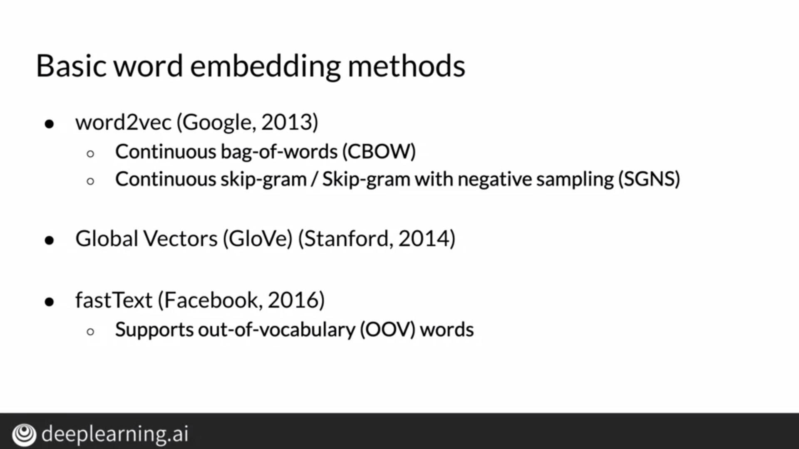

# Basic Word Representations

## Integers

One of the easiest way to represent words is by assigning a distinct integer to each word. However, this approach is too simple and doesn't capture any semantic relation or meaning between words.

## One-Hot Vectors

In this approach, we construct column vectors for each word. In this vector, the index or row corresponding to a distinct word has the value 1, and all other locations have a value of zero. This approach fails when the vocabulary is huge in size and this too doesn't capture the meaning of the word it represents.

## Word Embeddings

If we were to plot words as points on a 2D plane, we would place them in such a manner that similar words would be closer to each other. By creating such vector spaces where we represent words as vectors, we can construct word embeddings.

These vectors are more effective because they have a low dimension and they can capture the meaning of a word better than the previous two methods.

# How to Create Word Embeddings

To create word embeddings, we first need to create a specific vocabulary which generalizes to an application. For example, to create word embeddings of words used by Shakespeare, the vocabulary should consist of all the words used by Shakespeare. Then, we transform these words into numerical representations and train a machine learning model to find embeddings. This is a supervised and unsupervised task because the data has no labels to check against but it is supervised because we have all the information to extract embeddings.

# Word Embedding Methods

Using CBOW, we try to predict a word based on its context or the words surrounding it. In SGNS, we do the opposite by trying to predict words surrounding a particular word. We can use both these methods to create word embeddings and using SGNS in fastText, we're able to support out of vocabulary words too.

Basic methods have the limitation that a word which may have different meanings based on its context is represented by the same word vector. For example, the word "plant" could refer to an organism, a production plant or an adverb. Thus, advanced methods allow us to find different word embeddings based on deeper context which conveys what the word meant in the particular sentence.

# Continous Bag of Words Model

In this model, we try to predict a word on the basis of its surrounding words. The intuition behind this model is that 2 words which are generally surrounded by similar words tend to be related.

In this model, we choose a center word and we collect the words surrounding it. We set a hyperparameter that tells the model how many surrounding words can be considered as context. Using a sliding window, we take words to the left of the center word and words to the right of the center word.

We then feed the model the context words as input and the center word as the target.

# Cleaning and Tokenization

We need to clean and tokenize the data to use it in our model. Firstly, we should convert all words to uppercase or lowercase so that our words are case-insensitive. We also replace punctuation with a special token from the vocabulary to indicate a punctuation. For numbers, we can either just remove them or replace them with a special number token to represent a number. Special characters generally don't convey meaning so we can get rid of them and for special words and emojis, we just use the word or use the meaning of the emoji.

# Sliding Window of Words in Python

The get_windows function takes 2 inputs, and it yields center words with its context. First, we set the starting index equal to the context half-size. We then loop over the tokens till the window extends till the last token. We then take a center word and assign its preceding and succeeding words to context_words. The number of words taken depend on the context size. We then yield the center word and the context word so that we can return values from the function multiple times in one execution.

# Transforming Words into Vectors

We can represent target or center words using their one-hot representation. For context words, we sum all the context words and take the average.

The above vectors are column vectors but are shown as row vectors to accomodate them in the screen.

# Architecture of CBOW Model

We have an input layer with number of neurons equal to the length of the vocabulary. We pass the context word vector to the input layer which is fully connected to the hidden layer. This hidden layer contains N neurons where N is a hyperparameter denoting the word embedding size. We apply the softmax activation to the output of this layer and we get the output layer which represents the center word vector.

## Dimensions

We use weight and bias matrices to connect the input layer and the hidden layer. These layers are represented as column vectors where each individual row entry represents the value of a neuron. We multiply weight matrix having dimensions(N x V) with the input layer vector having dimensions(V X 1) and add the bias vector having dimensions(N X 1) to it. We then use the Relu activation function and obtain the Hidden Layer Vector having dimensions(N X 1). We multiply a weight matrix having dimensions(V X N) with the hidden layer vector having dimensions(N X 1) and then add the bias vector. We apply the softmax activation on this vector and obtain the output layer.

## Batch Size

Batch Size is a hyperparameter that we define to process multiple inputs in one pass. Our input vector will now have m columns instead of 1. Note, this has no effect on the dimensions of the weight matrix but bias matrix will have m columns too. However, broadcasting in numpy allows us to use the bias vector with one column.

In these batches, the first column of the input vector corresponds with the first column of the output vector, or to generalize, the ith column of the input vector corresponds to the ith column of the output vector.

# Activation Functions

## Relu

Relu outputs zero for a negative number and the number itself for a non-negative number.

## Softmax

The softmax function converts a vector into a vector of numbers that can be interpreted as probabilities. The exponential function is used where the exponent of each row is calculated and is divide by the sum of the exponents of the column.

The word corresponding to the maximum probability in the colum is the predicted center word.

# Training a CBOW Model

## Cost Function

For the loss function, we use the cross-entropy loss and we try to minimize this loss by adjusting values of weight and bias matrices.

Cross-entropy loss penalizes the model for predicting low probabilities for the target label and rewards the model for predicting high probabilities for the target label.

## Forward Propagation

In forward propagation, we calculate the vectors corresponding to the layers in the architecture.

## Cost

We refer to cost as the average of losses for all input vectors in a batch. We calculate the cross-entropy loss for each output vector and take the mean of all these losses.

## Backpropagation

Using backpropagation, we can change the weight and bias matrices to minimize the loss. We find the derivative of the loss function with respect to these matrices. We use the chain rule to find the derivative of the loss function as we move from the output layer to the input layer.

## Gradient Descent

Using gradient descent, we modify these matrices using a learning parameter. Increasing the learning parameter leads to more drastic changes.

# Extracting Word Embedding Vectors

As we saw earlier, the output of our neural network represents a one-hot vector representing our target word but we need to extract the embeddings of this word instead. We can do this in 3 ways, either we can extract it from W1, from W2, or we can take the average of W1 and W2 to get the word embeddings.

## Method 1

The shape of our word embedding will be (N,1). Shape of W1 is (N,V) where every column is a N-dimensional vector corresponding to a word in the vocabulary. Thus, for a particular word in the vocabulary, we can extract the corresponding column in W1 to get its word embeddings.

## Method 2

We can do something similar for matrix W2 and retrieve word embeddings from it. Recall, W2 has a shape of (V,N) and each row vector corresponds to a word in the vocabulary. Thus, for a particular word in the vocabulary, we can extract the corresponding row in W2 to get its word embeddings.

## Method 3

The third method is just a combination of the first 2 methods and we basically just take the average of the word embeddings derived from the first two methods.

# Intrinsic Evaluation

Intrinsic evaluation refers to testing the relationships between words, whether it's semantic or syntactic. Semantic refers to meaning whereas syntactic refers to grammar. We can explore these analogies using K-Nearest neighbours.

# Extrinsic Evaluation

Extrinsic evaluation refers to testing our word-embeddings on a real-life application and the results of these applications let us assess how accurate these embeddings are. These methods are the ultimate test for evaluation but they can be time-consuming.

