# Neural Networks for Sentiment Analysis

We use deep learning to develop a robust classifier for sentiment analysis. Neural Networks have produced great results in the domain of NLP and we can use a neural network for sentiment analysis too.

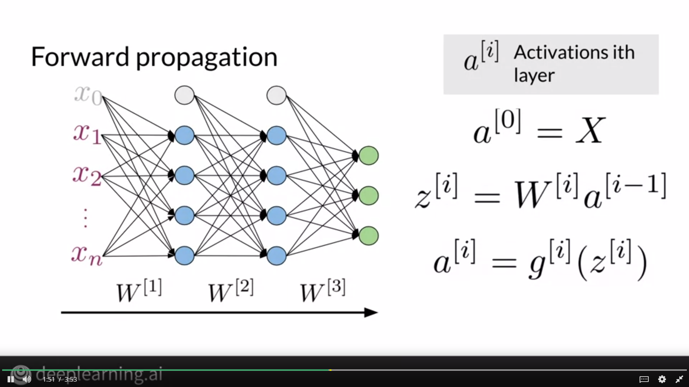
In the architecture shown above, we take an input vector and perform specific computations to propagate these values. For each layer, we take input from the previous layer, multiply it by a weight matrix and apply an activation function.

For Sentiment Analysis, we take an input vector and we transform this vector to get embeddings and we call this the embedding layer. This layer encodes information about the word and then we further propagate these embeddings. At the end, we get two output neurons since this is a binary classification task.

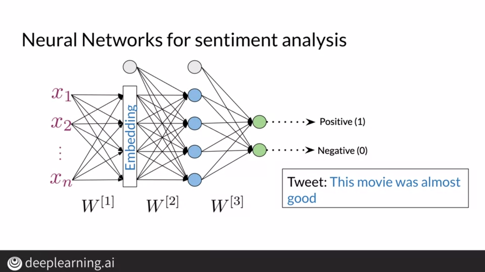

To represent sentences as vectors, we construct a vocabulary and assign an integer to each word. We then construct a vector of all integers corresponding to all words in a sentence and pad them at the end so that all vectors have the same size regardless of the sentence length.

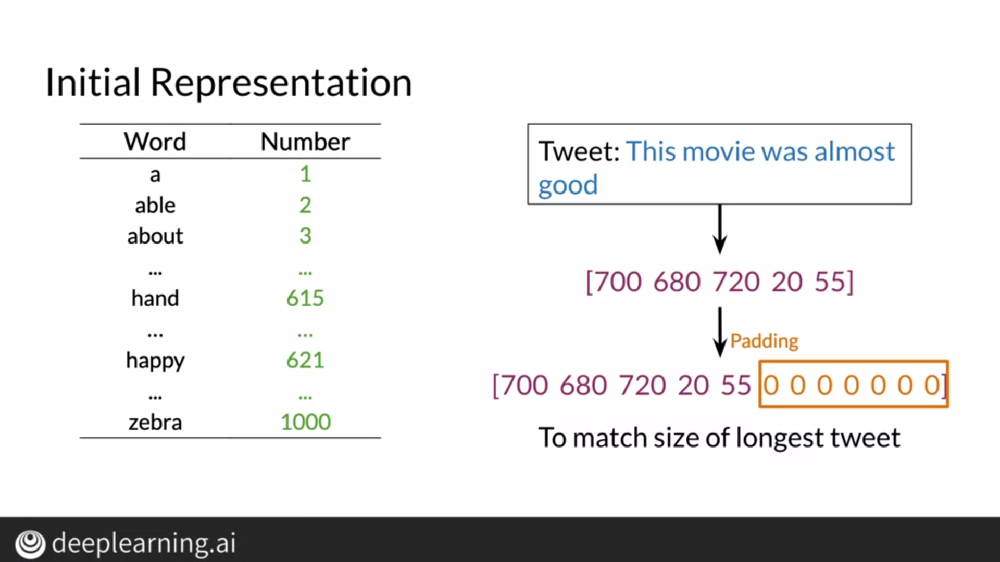

# Neural Networks in Trax

Using Trax, we can easily build neural networks. These frameworks are recommended because they are designed to run fast on CPUs, GPUs, and even TPUs. For Trax, we need to specify each layer of computation as shown below.

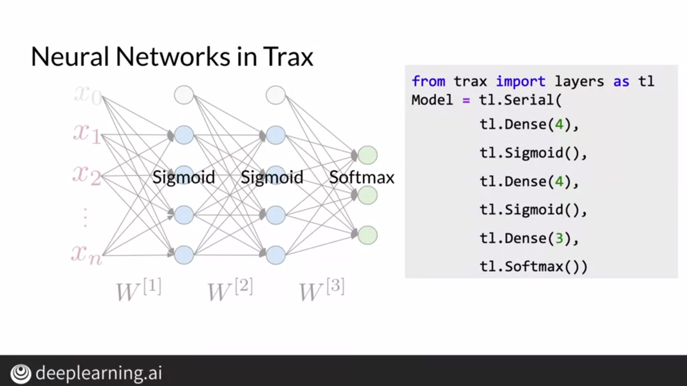

# Classes

Classes in python allow us to define an object along with its parameters and methods related to that object. For an object color, its parameters could be its RGB value and we can also define methods for such a class.

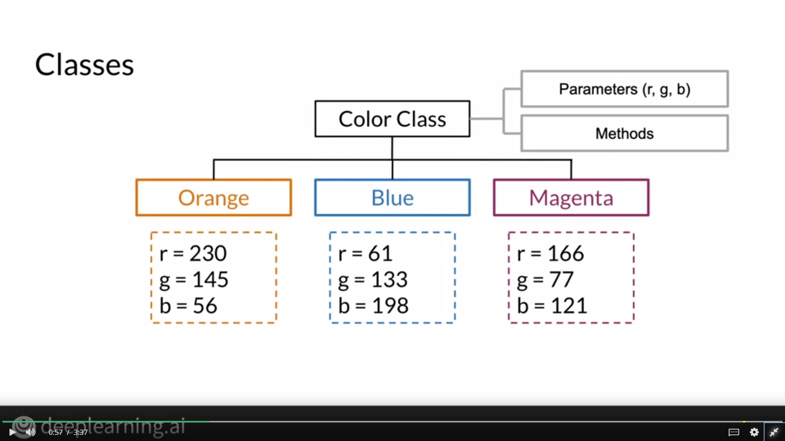

# Dense and Relu Layers

A dense layer is fully connected to its input values and it transforms these input values by multiplying them with a weight matrix.

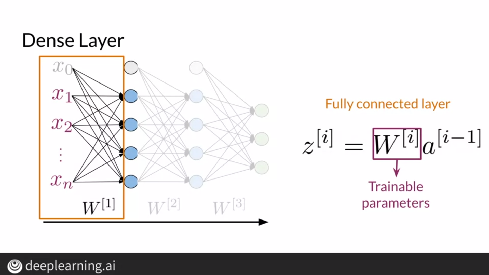

A relu layer simply applies a function where each negative value has an output of zero and for a non-negative input, output is same as input.

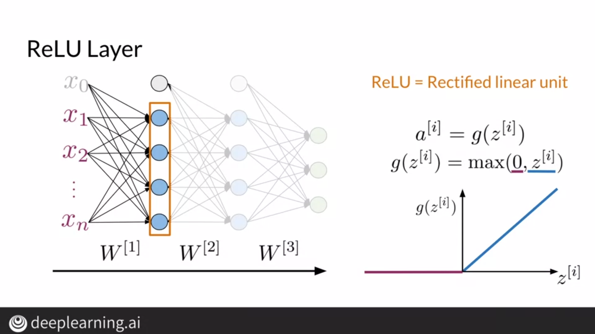

# Serial Layer

A serial layer is a compostion of sublayers where individual layers of a neural network are arranged sequentially.

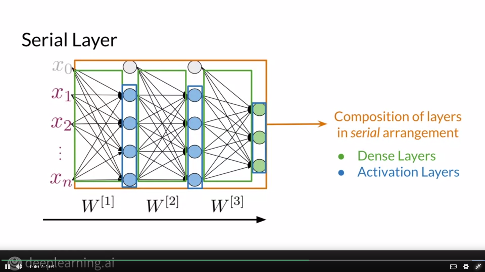

# Other Layers

## Embedding Layer

An embedding layer takes input as a word representation and calculates the embedding corresponding to the word. Weights involved in calculating these layers are trainable and are trained to achieve the best possible result on our application. The dimension of the weight matrix is Vocabulary x Embeddings.

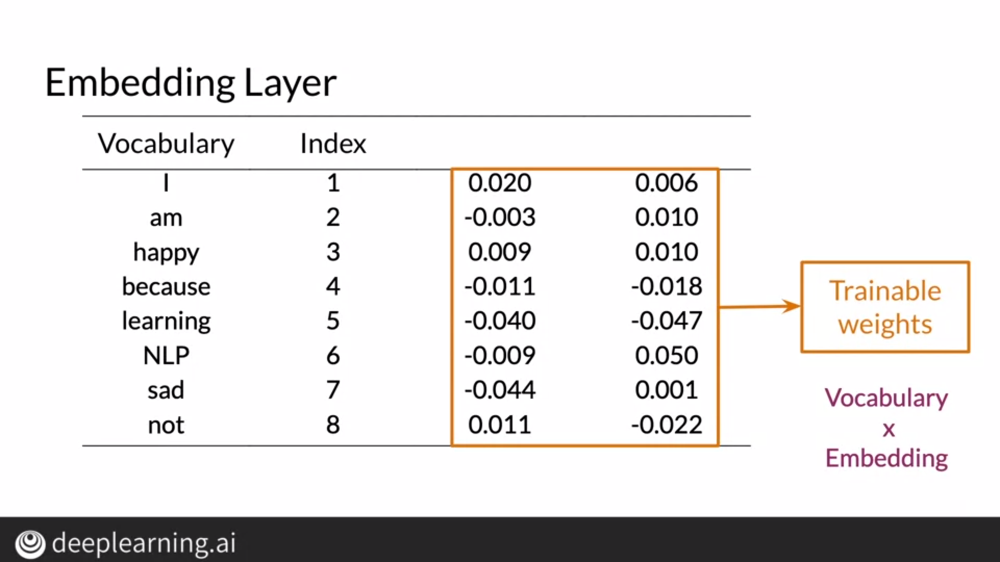

## Mean Layer

A sentence contains more than one word, and each word has its own embedding. To simplify the embedding, we take the mean of all features in the embedding.

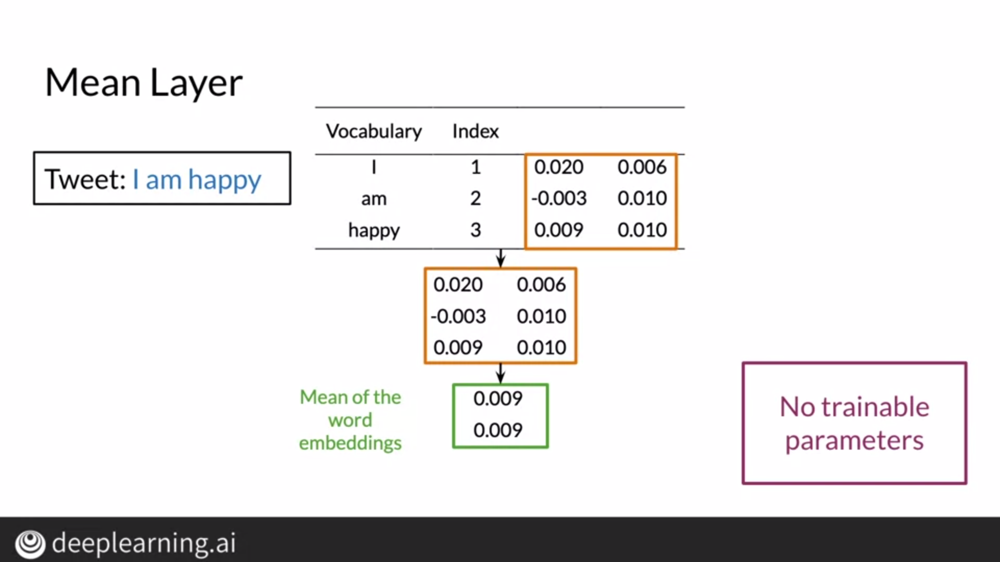

# Training

Using Trax, we can easily train our model by finding the gradient and by training the model until we reach convergence. We pass the forward function and the parameters against which we have to evaluate the gradient.

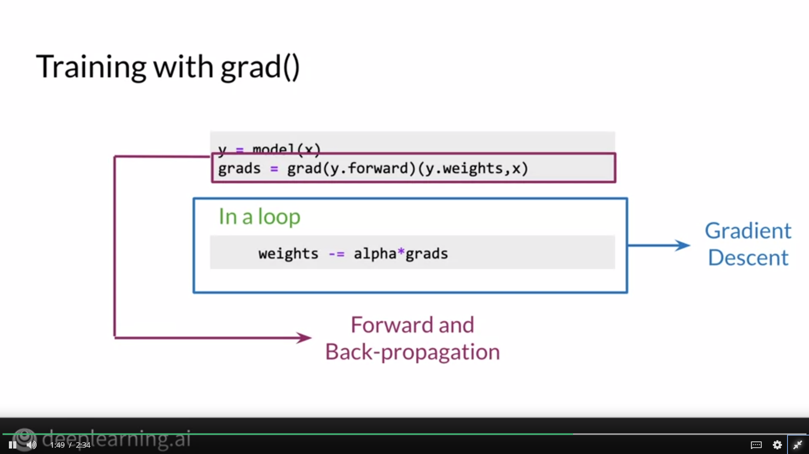