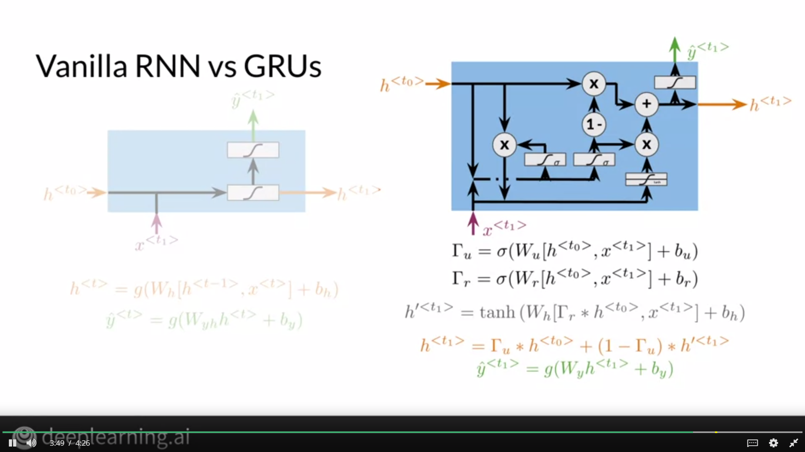
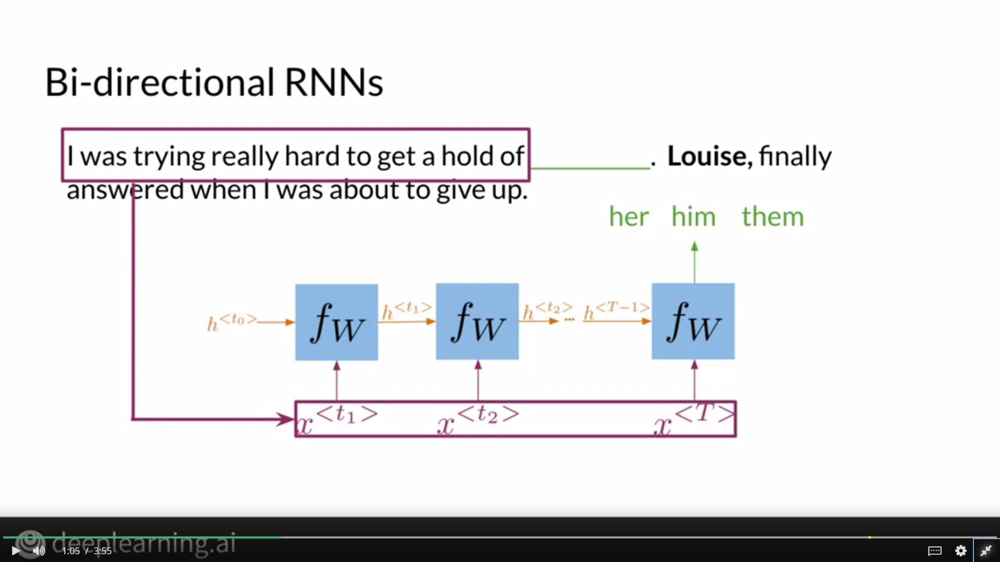

# Traditional Language Models

Using the n-gram model we saw in the previous lectures, we can compute the probability of a sequence. However, this approach tends to fail eventually because it can't capture dependencies between distant words and it requires a lot of space and RAM

# Recurrent Neural Networks 

As we saw that traditional models can't capture long term dependencies, we can use RNNs which allow us to propagate information and use it to make predictions.

As you can see in the above image, we use the sequence of words to predict the answer. We also propagate context from previous words and we can do all of this using weight matrices which are learnable. For example, Wx is used to encode the input word whereas Wh is used to encode the context. Finally, matrix W makes the prediction.

# Applications of RNNs

## One to One 

In these architectures, we have one input and one corresponding output. For example, we might try to predict the position of a team on a league table by using the results of their past fixtures.

## One to Many

We use such an architecture when we have one input and a sequence of outputs. For example, in image captioning, we have the image as an input and a sequence of words as the output.

## Many to One

We used a sequence of inputs to determine an output. For example, we would use a Many to One architecture for sentiemnt analysis since we have a sequence of words as input and label as an output.

## Many to Many

We use these architectures when we have a sequence of inputs and a sequence of outputs. For example, in machine translation, we have a sequence of words as input and a sequence of words as output.

# Math in Simple RNNs

In Vanilla RNNs, we can use weight matrices Whh and Whx to multiply with the previous hidden state vector and input vector respectively. We can take the elementwise sum of the 2 vectors obtained to find the hidden state vector. We can use this hidden state vector to predict the output vector using Wyh and we propagate this hidden state vector to the next RNN cell.

# Cost Function for RNNs

For Vanilla RNNs, we take the average of the cost through time. We use Cross-Entropy loss to calculate the loss.

# Gated Recurrent Units

In Vanilla RNNs, long sequences lead to vanishing gradients and eventually, information is lost. To tackle this, we can use GRUs. GRUs have a relevance gate and an update gate which determines the amount of information to retain and update.

We apply the sigmoid activation to squeeze values between 0 and 1 in the relevance and update vectors. We then multiply the previous hidden state vector with the relevance vector before computing the hidden state candidate. Finally, using the previous hidden state and the hidden state candidate, we compute the current hidden state using the update gate.

As compared to Vanilla RNNs, GRUs have more computations to perform but can retain information even if the sequence is long.

# Deep and Bidirectional RNNs

## Bidirectional RNNs

Sometimes, a word we want to predict might to be related to a word further ahead in the sentence. In order to get information from words lying ahead of the word we want to predict, we use bidirectional RNNs. It is an acyclic process so forward propagation in both directions are independent of each other.

For prediction, we can use the hidden state obtained from both directions.

## Deep RNNs

We use Deep RNNs for better results and memory retention. In one pass, we forward propagate through all time steps and get hidden states for the current layer. We then pass these hidden states to the next layer and the process continues.

