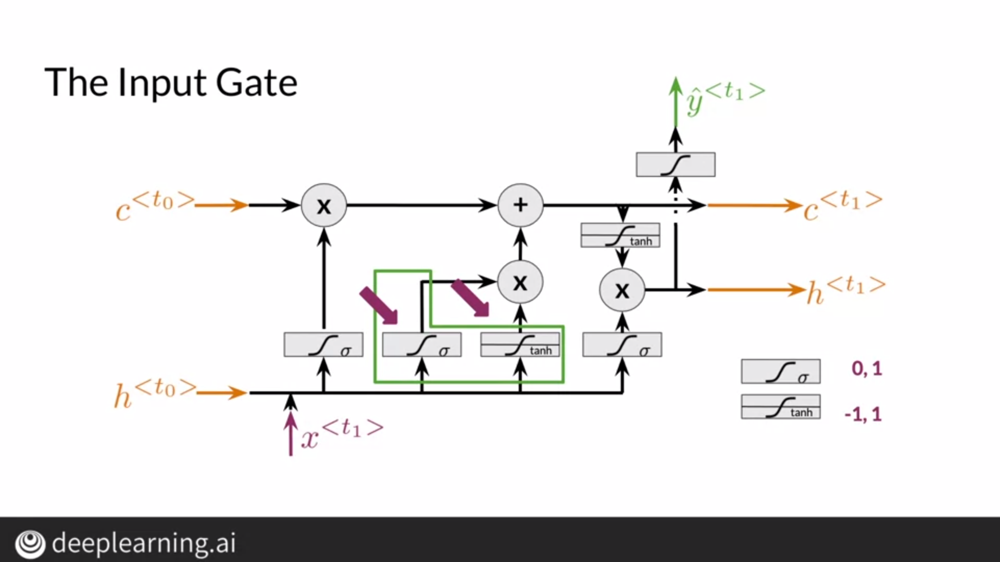

# RNNs and Vanishing Gradients

Vanilla RNNs suffer from problems such as vanishing gradients when the sequence becomes too long. This inhibits it from training properly and leads to an unstable network.

During backpropagation, we compute the gradients from the output layer to the input layer using the chain rule. This leads to multiplication of gradients and eventually the gradients keep diminishing. This leads to an unstable network since we can't update the weights of our network as the gradients tend to zero.

## Solving Vanishing Gradient

We can employ certain techniques to avoid this problem. We can initialize the weights as identity matrices and apply the relu activation so that negative values turn to 0. To deal with exploding gradients, we can clip these gradients to a certain value. We can also use skip connections so that earlier layers can have influence in the cost function.

# Introduction to LSTMs

Vanilla RNNs suffer from various problems such as vanishing gradients and inability to remember long sequences. A novel solution to this would be LSTMs or Long Short Term Memories which is a RNN architecture that can determine how much information to remember and how much to forget.

LSTMs consists of a cell and 3 gates, a forget gate, an update gate and an output gate. First, we find a vector containing values from 0 and 1 from the forget gate and multiply this vector with the previous hidden state to retain only certain information. We then pass this to the update gate to update the values of the hidden state and the cell state. We then use this to determine the output using the output gate.

# LSTM Architecture

## Forget Gate

The forget gate determines which values to keep and which to forget. Using the hidden state and the input vector, a forget vector is produced after applying the sigmoid activation. This restricts its values from 0 to 1, where values closer to 0 lead to forgetting values whereas values closer to 1 lead to retaining values.

## Input Gate

We can find the candidate cell state vector using the input gate. We use the sigmoid activation to determine which values to update and the tanh activation to regulate the flow of information. Finally we perform addition on the previous cell state and the candidate cell state.

## Output Gate

We calculate the output vector and multiply it with the cell state vector after applying the tanh function on it.

# Named Entity Recognition

Named entity recognition is the task of identifying entities from a sentence. There can be multiple types of entities as shown below.

Thus, given a statement, our model should be able to identify which word is an entity and predict its type.

There are several applications where Named Entity Recognition is involved and it helps NLP systems to focus on specific pieces of a corpora.

# Data Preprocessing

For Named Entity recognition, we can create an array to represent sentences by assigning each word a particular index and creating an array by mapping each word to its index. For entity classes, we can do the same by assigning each entity an index.

We then create a tensor for each input and process them in batches. We feed them into a LSTM unit and use the dense layer at the end. We use log softmax and softmax for better numerical representation.

# Computing Accuracy

To compute accuracy, we need to iterate through the test set, find the predicted label for each output, mask padded tokens, and then match our predicted labels with the actual labels to evaluate the accuracy.

