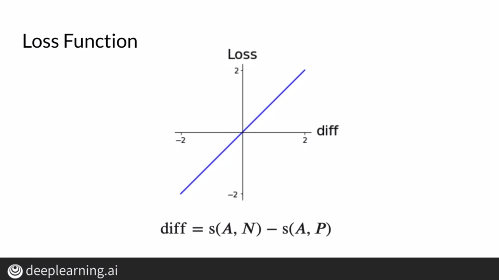

# Siamese Networks

Sometimes, we may want to predict how similar two entities are. For this purpose, we use Siamese Networks which allow us to find out if two entities are the same or not.

These sort of networks are used on online forums such as Quora to find whether a new question is a duplicate of a previous question so that repetitive questions don't flood the forum. These networks are also used by search engines to identify similar queries.

# Architecture

Siamese Networks can be seen as twin networks which take 2 different inputs and compare the results at the end to find how similar the 2 inputs were. These two networks have the same trained parameters because we want both the inputs to go through the same transformations.

We can find the similarity of the two vectors produced at the end using the cosine similarity. We can set a threshold where a greater threshold would require greater similarity to be classified as duplicates.

# Cost Function

Using the cosine similarity, we evaluate how similar two vectors are. For duplicate questions, the cosine similarity should tend to 1 and for dissimilar questions, it should tend to -1.

We have an anchor question, with respect to which we find a duplicate. Duplicates are called positive questions whereas non-duplicates are called negative questions. Cost can be evaluated as the difference between cosine similarity of the anchor with a negative question and the cosine similarity of the anchor with a positive question.

# Triplets

To compute loss, we generate triplets containing one anchor question along with a positive and negative question. As explained above, a negative loss is an indication of good performance but if this negative loss is used to update weights, our model deviates from the good performance it exhibited. Thus, we clip negative values to zero as we don't want the model to deviate from good performance. However, if the model is performing just marginally well, we introduce a difference parameter which shifts our loss function.

## Triplet Selection

Forming the correct triplets plays a crucial role because triplets which are "easy" don't tend to help the model a lot and the model can't learn nuances because of this. By "easy", we mean positive questions which are obviously duplicates and negative questions which are obviously non-duplicates. Instead, triplets which are harder to fit to because the similarity scores are similar tend to impact the model a lot more and help it understand nuances.

# Computing the Cost

## Preparing batches

Corresponding to each question, we'll have its duplicate question and this forms a pair of questions. We form a batch by taking these pairs and the batch size is equal to the number of pairs. Note, all questions along a column are dissimilar.

## Computing Cost

Matrix v1 is constructed using the first column of the batch and matrix v2 is constructed using the second column. We generate embeddings for each question using the embedding layer. We then find the cosine similarity between a row in v1 with every other row in v2. We get a matrix where the similarity score between question i in v1 and question j in v2 is stored at (i,j).

Along the diagonal, the similarity score for question and its duplicates are stored whereas other cells contain similarity scores for non-duplicate questions.

## Hard Negative Mining

Once we obtain the similarity score matrix, we can find the cost in 2 ways. We can take the average of all off-diagonals in each row to find the similarity score for a question and non-duplicates. Taking the average helps us reduce noise and helps the model train better. We could also find the off diagonal closest to the diagonal value in each row. This example tends to provide the most to the model in terms of learning because the model needs to work the most on such an example.

After computing these values, we calculate loss corresponding to both and sum them to find the total cost.

# One Short Learning

In a situation where we want to identify a signature, we use one short learning. Instead of using classification which requires multiple examples of a particular class for training, we simply compute the similarity between vectors to determine if they belong to the same class. In classification, we need to retrain a model every time we encounter a new class which can be problematic if we're trying to classify signatures, which is why we use one-shot learning.

# Training and Testing

We prepare batches as discussed above where the batch for each subnetwork will have number of questions equal to the batch size. Each question in the first batch will correspond to a duplicate question in the second batch.

## Model

We convert the questions into embeddings using the embedding layer of the model. We feed these embeddings to a LSTM layer which gives us a vector. We compute the similarity score between vectors produced by the subnetworks. Testing is done through one shot learning.

